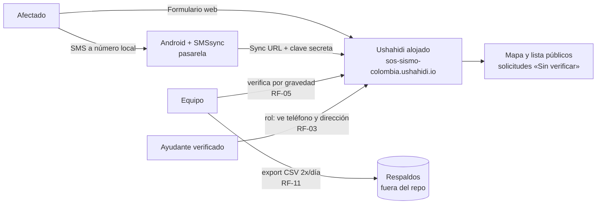

# 02 · Diseño

**Despliegue en producción:** https://sos-sismo-colombia.ushahidi.io/

## Contexto y restricciones

Sismo M 7,4 (10-ago-2026, epicentro San José del Palmar, Chocó). Conectividad de datos intermitente en Chocó, Valle del Cauca, Risaralda, Quindío y Caldas. Equipo pequeño operando la plataforma; verificación 100 % humana. Presupuesto: $0/mes.

## Arquitectura — Fase 1

Toda la infraestructura web (hosting, base de datos, escalado) la opera Ushahidi (ADR-001). Nuestro sistema es: **la configuración** (encuestas, campos, visibilidades, roles) + **la pasarela SMS** + **los procedimientos humanos**.

## Modelo de información

La **fuente de verdad** de encuestas, campos, tipos, obligatoriedad, visibilidad y textos es [`config/deployment-config.yml`](../config/deployment-config.yml). Resumen:

- **3 encuestas:** «🆘 Pido ayuda» (14 campos), «🔍 Busco a un familiar», «🤝 Quiero ayudar» (todos sus campos solo-admin).
- **3 niveles de visibilidad:** `publico` · `protegido` (Ayudantes verificados + admins) · `solo_admin`.
- **10 categorías** de necesidad, vinculadas al campo «¿Qué necesitas?».
- **2 roles:** administrador (nativo) y **Ayudante verificado** (personalizado; se otorga solo manualmente, RF-08).
- **Campos de ciclo de vida:** Estado (Pendiente → En atención → Resuelta) y Verificación (Sin verificar → Verificada por el equipo), ambos visibles para todos pero editables solo por quien tenga permiso de gestionar publicaciones.

## Flujos clave

**F1 · Solicitud por web:** Afectado abre el formulario sin cuenta → llena obligatorios (pin a nivel barrio; dirección exacta en campo protegido) → publica → visible al instante como «Sin verificar» (RF-01, RF-02, RF-04).

**F2 · Solicitud por SMS:** Afectado envía SMS al número local → SMSsync lo reenvía a la Sync URL con clave secreta → entra como publicación de texto libre → respuesta automática confirma y pide municipio/barrio/personas → el Equipo le pone categoría, urgencia y pin (RF-09).

**F3 · Verificación de solicitud:** Equipo abre la búsqueda guardada «Críticas sin verificar» → contacta o cruza datos → marca «Verificada por el equipo»; lo falso/duplicado se archiva, nunca se borra (RF-05, RNF-04).

**F4 · Alta de ayudante:** llena «Quiero ayudar» (solo-admin) y crea su cuenta → **el Equipo lo llama** y confirma nombre + organización con dato contrastable → el Equipo le asigna el rol «Ayudante verificado» y le comunica las 4 reglas → desde entonces ve campos protegidos y puede actualizar Estados (RF-08). Sin excepciones automáticas.

## Decisiones de arquitectura (ADR)

| ADR | Decisión | Alternativas descartadas | Razón y consecuencia |
|---|---|---|---|
| 001 | Ushahidi Basic **alojado** | Construir desde cero; autoalojar ya | Al aire en horas, $0, publicaciones ilimitadas, SMS nativo. Consecuencia: no controlamos infra ni código → plan B en Fase 2 (RF-F2-02). |
| 002 | Publicación **instantánea + etiqueta** «Sin verificar» | Híbrido estricto por urgencia | Ushahidi no ramifica la publicación según un campo sin modificar código. El híbrido estricto queda especificado como RF-F2-01. |
| 003 | SMS con **SIM local + SMSsync** | Número virtual internacional (Twilio) | La víctima paga tarifa nacional y es la ruta oficialmente documentada. Consecuencia: teléfono Android dedicado y estructuración manual de SMS. |
| 004 | Consentimiento = **llenar el campo protegido**, con texto claro al lado | Checkbox de consentimiento aparte | Menos fricción en crisis con el mismo efecto: el campo es opcional y el texto explica exactamente quién lo verá. |
| 005 | Verificación de ayudantes **100 % humana por el equipo** | Auto-aprobación, verificación por documento subido | Decisión reafirmada por el equipo: datos (nombre + organización + teléfono) **más** llamada de confirmación. Nada automático toca datos protegidos. |

## Fase 2 (diseño previsto, no bloqueante)

Autoalojado: `ushahidi/platform` + cliente en Docker, detrás de Cloudflare (CDN + modo bajo ataque), importando los CSV de Fase 1. Ahí vive el código del híbrido estricto (RF-F2-01), la aplicación automática de `deployment-config.yml` vía API (RF-F2-03) y el script de anonimización (RF-F2-04). Cualquier código nuevo entra por spec → tarea → implementación (P8) bajo licencia MIT.
