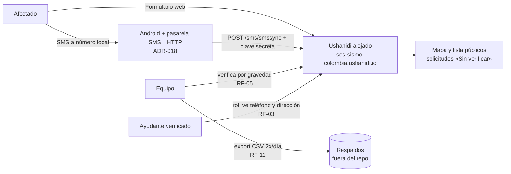

# 02 · Diseño

**Cara pública (lo que se difunde):** https://www.sossismocolombia.com.co/ · **SMS:** 3148071191
**Backend Ushahidi (panel del equipo):** https://sos-sismo-colombia.ushahidi.io/

## Contexto y restricciones

Sismo M 7,4 (10-ago-2026, epicentro San José del Palmar, Chocó). Conectividad de datos intermitente en Chocó, Valle del Cauca, Risaralda, Quindío y Caldas. Equipo pequeño operando la plataforma; verificación 100 % humana. Presupuesto: $0/mes.

## Arquitectura — Fase 1

Toda la infraestructura web (hosting, base de datos, escalado) la opera Ushahidi (ADR-001). Nuestro sistema es: **la configuración** (encuestas, campos, visibilidades, roles) + **la pasarela SMS** + **los procedimientos humanos**.

## Modelo de información

La **fuente de verdad** de encuestas, campos, tipos, obligatoriedad, visibilidad y textos es [`config/deployment-config.yml`](../config/deployment-config.yml). Resumen:

- **3 encuestas:** «🆘 Pido ayuda» (14 campos), «🔍 Busco a un familiar», «🤝 Quiero ayudar» (todos sus campos solo-admin).
- **3 niveles de visibilidad:** `publico` · `protegido` (Ayudantes verificados + admins) · `solo_admin`.
- **10 categorías** de necesidad, vinculadas al campo «¿Qué necesitas?».
- **2 roles:** administrador (nativo) y **Ayudante verificado** (personalizado; se otorga solo manualmente, RF-08).
- **Campos de ciclo de vida:** Estado (Pendiente → En atención → Resuelta) y Verificación (Sin verificar → Verificada por el equipo), ambos visibles para todos pero editables solo por quien tenga permiso de gestionar publicaciones.

## Flujos clave

**F1 · Solicitud por web:** Afectado abre el formulario sin cuenta → llena obligatorios (pin a nivel barrio; dirección exacta en campo protegido) → publica → visible al instante como «Sin verificar» (RF-01, RF-02, RF-04).

**F2 · Solicitud por SMS:** Afectado envía SMS al número local → el Android de guardia lo reenvía por POST a `/sms/smssync` con la clave secreta → entra como publicación de texto libre (`source: sms`) → la pasarela responde por SMS confirmando y pidiendo municipio/barrio/personas → el Equipo le pone categoría, urgencia y pin (RF-09, ADR-018). El afectado solo necesita señal de voz/SMS; quien necesita datos es **nuestro** teléfono, que por eso vive fuera de la zona afectada y enchufado a corriente.

**F3 · Verificación de solicitud:** Equipo abre la búsqueda guardada «Críticas sin verificar» → contacta o cruza datos → marca «Verificada por el equipo»; lo falso/duplicado se archiva, nunca se borra (RF-05, RNF-04).

**F4 · Alta de ayudante:** llena «Quiero ayudar» (solo-admin) y crea su cuenta → **el Equipo lo llama** y confirma nombre + organización con dato contrastable → el Equipo le asigna el rol «Ayudante verificado» y le comunica las 4 reglas → desde entonces ve campos protegidos y puede actualizar Estados (RF-08). Sin excepciones automáticas.

**F5 · Oferta de recurso:** el oferente registra su recurso (contacto protegido) → aparece en el mapa como 🟢 Disponible → el Equipo o el enlace de un organismo lo cruza con una necesidad y lo marca 🔵 Asignado → al liberarse vuelve a Disponible o pasa a ⚪ Retirado (RF-14). La maquinaria nunca se autodespacha a un punto de rescate.

## Decisiones de arquitectura (ADR)

| ADR | Decisión | Alternativas descartadas | Razón y consecuencia |
|---|---|---|---|
| 001 | Ushahidi Basic **alojado** | Construir desde cero; autoalojar ya | Al aire en horas, $0, publicaciones ilimitadas, SMS nativo. Consecuencia: no controlamos infra ni código → plan B en Fase 2 (RF-F2-02). |
| 002 | Publicación **instantánea + etiqueta** «Sin verificar» | Híbrido estricto por urgencia | Ushahidi no ramifica la publicación según un campo sin modificar código. El híbrido estricto queda especificado como RF-F2-01. |
| 003 | SMS con **SIM local** (número colombiano real) | Número virtual internacional (Twilio, Nexmo) | La víctima paga tarifa nacional. Consecuencia: teléfono Android dedicado y estructuración manual de SMS. **La parte «con la app SMSsync» la reemplaza ADR-018;** la decisión de SIM local sigue en pie y es la que manda. |
| 004 | Consentimiento = **llenar el campo protegido**, con texto claro al lado | Checkbox de consentimiento aparte | Menos fricción en crisis con el mismo efecto: el campo es opcional y el texto explica exactamente quién lo verá. |
| 005 | Verificación de ayudantes **100 % humana por el equipo** | Auto-aprobación, verificación por documento subido | Decisión reafirmada por el equipo: datos (nombre + organización + teléfono) **más** llamada de confirmación. Nada automático toca datos protegidos. |
| 014 | Validación **por capas**, casi toda en modo aviso | Bloquear todo lo sospechoso; no validar nada | Cada obstáculo es fricción para alguien asustado (P1), y bloquear a una víctima real es peor que dejar pasar ruido que el equipo archiva. Solo se bloquea lo que hace la solicitud inservible para quien va a ayudar: punto fuera de Colombia, cantidad imposible, título ilegible. El resto avisa y deja decidir. El aviso de duplicados enseña las solicitudes cercanas recientes porque quien reporta es quien sabe si es el mismo caso. **La validación vive en el cliente y es evitable con curl** (RF-13): es ayuda, no control de acceso. |
| 013 | **Ushahidi se queda como backend**, con revisión a las 72 h (**13-ago-2026**) | Migrar ya a Postgres propio + API nuestra | Las rarezas de la plataforma ya están pagadas y documentadas (ADR-006…009, 011); lo que nos da —control de acceso a los datos de las víctimas **verificado contra la API**, roles, panel de triaje y exportación— es justo lo que no se reescribe sin probar en plena emergencia (P2). El coste ya es hundido; el beneficio sigue vigente. **Se migra si en la revisión se cumple cualquiera de estos criterios:** (a) el equipo no usó el panel para triar; (b) el SMS quedó descartado; (c) aparecieron 2 o más rarezas nuevas que bloquearan la operación. Si se cumple alguno, la migración entra por spec antes que por código (P8). Revisión anotada como T-019. |
| 010 | **Cara pública propia** (Next.js en Vercel, `web/`) contra la API alojada; el equipo sigue triando en el admin de Ushahidi | Usar el cliente de Ushahidi tal cual; autoalojar el backend (RF-F2-02) | El cliente de Ushahidi trae `default_locale: en_US` fijo y una interfaz pesada y genérica para alguien asustado con mala señal. Un front propio de tres formularios da castellano real, carga mínima, sin webfonts, y control del mapa (Leaflet + teselas Humanitarian OSM, sin clave). **No se toca el backend:** cero migración y el equipo conserva roles, campos protegidos, búsquedas guardadas y exportación CSV. Consecuencia: dos caras sobre los mismos datos; el esquema se lee de la API en vivo, así que el YAML sigue mandando. |
| 011 | «Estado» y «Verificación» **no se muestran**: el front los envía con su valor por defecto | Dejarlos en el formulario; moverlos a una etapa interna de Ushahidi | En el formulario público cualquiera podía marcarse «✔️ Verificada por el equipo», vaciando de sentido la cola de verificación (RF-05). La etapa interna los oculta pero **el valor por defecto no se aplica** (comprobado: el campo nace `null`), lo que rompería las búsquedas guardadas. Enviarlos desde el código resuelve las dos cosas a la vez. Pendiente: quien publique desde el cliente de Ushahidi los seguirá viendo. |
| 008 | Campos de imagen: `input: "image"` **con** `config: {hasCaption, maxUploadSize}` | `input: "upload"` sin config, que la API acepta | La API los guarda, pero el cliente no reconoce `upload`, obtiene `null` y **rompe el formulario entero** con «Cannot read properties of null (reading 'hasCaption')». Confirmado en `core/helpers/survey.ts` del cliente. Consecuencia: la API acepta configuraciones que el cliente no sabe pintar — hay que probar en el navegador, no solo auditar por API. |
| 009 | Mapa: capa **`hOSM`** (Humanitarian OpenStreetMap) y `fit_map_boundaries: false` | `streets` o `satellite` de Mapbox; montar un cliente propio con clave Mapbox propia | Las capas Mapbox del cliente (`streets`, `satellite`, `MapQuest…`) usan la **cuenta compartida de Ushahidi, que devuelve 403 en todas las teselas** — token válido, cuenta agotada. El cliente lee la clave solo de `./env.json` (estático, servido por Ushahidi), así que **no hay forma de poner clave propia en el alojado**. `hOSM` no necesita clave, carga (HTTP 200), y está pensada para respuesta a desastres: mejor cobertura rural del Chocó. Esto evitó tener que autoalojar el cliente. Además, con 0 publicaciones el auto-encuadre ignora el centro configurado. **Cuidado:** un PUT parcial de `default_view` devuelve el resto a fábrica (Nairobi, zoom 2) — enviarlo siempre completo; la auditoría lo comprueba. |
| 007 | **Sin emoji** en nombres de categoría y de encuesta | Emoji en todo, como en el borrador | Verificado contra la API v5 real: valida esos nombres contra `/^[\pL\pN\pP ]+$/u` y rechaza símbolos (HTTP 422). Consecuencia: los emoji se conservan donde sí pasan y donde más ayudan a leer rápido — **etiquetas de campo, opciones** (🔴 CRÍTICA, 🕐 Pendiente) **y textos de ayuda**. |
| 006 | **Un solo nivel de privacidad** por campo (`response_private`), gobernado por el permiso «Manage Posts» | Visibilidad por rol campo a campo | Verificado contra la API v5 real (10-ago-2026): el campo acepta la clave `role` pero **la descarta**. Consecuencia: «protegido» y «solo_admin» colapsan en un mismo nivel — los Ayudantes verificados también ven los datos de contacto de otros ayudantes (RF-08). Aceptable: son datos de ayudantes adultos que consintieron, no de víctimas; el riesgo real (teléfono y dirección de afectados) sigue cubierto. Si se necesita separación estricta, exige autoalojado (RF-F2-02). |
| 015 | **Encuesta «Ofrezco recursos»** con estados Disponible/Asignado y la regla de que la maquinaria solo entra bajo solicitud de un organismo | Coordinar las ofertas por WhatsApp; permitir remoción espontánea de escombros | El mapa necesita los dos lados para cruzar necesidad↔recurso (RF-14), y la remoción espontánea puede colapsar la bolsa de aire donde alguien respira. Los estados evitan el doble despacho; el contacto del oferente queda protegido igual que el de cualquier afectado. |
| 016 | **Aprobación previa en las dos encuestas de oferta** («Quiero ayudar», «Ofrezco recursos»): entran como borrador y solo las ve el equipo. El mapa público muestra únicamente las dos de auxilio | Filtrar solo en el front; dejarlo todo público como hasta ahora | Filtrar en el front no esconde nada: `GET /api/v5/posts` responde sin token y devuelve igual los títulos de las ofertas — comprobado el 11-ago-2026 con el post 19, «Retroexcavadora — Pereira», legible por cualquiera. Además el mapa **es** la herramienta de triaje: mezclar ofertas y registros de voluntarios con personas atrapadas le quita el sentido, y la categoría «Iluminación / energía» se retiró de las necesidades por lo mismo (haría falta en toda la zona, así que no discrimina nada). Consecuencia: se rompe la publicación instantánea (RF-02) **solo** donde nadie espera al aire, y el equipo asume revisar esa cola. `require_approval` rige solo para los envíos nuevos: lo ya publicado se despublica a mano. **Cómo:** `PATCH /api/v5/posts/{id}` con `{"status": "draft"}`. Un PUT con el cuerpo completo que devuelve el propio GET revienta con **HTTP 500 «Array to string conversion»** — la representación de lectura no es reenviable. Comprobado con el post 19: el PATCH lo pasó a borrador conservando sus 9 campos. |
| 017 | La insignia de verificado sale de la **colección** «Verificadas por el equipo», nunca del campo «Verificación» | Seguir leyendo el campo; quitar la insignia del todo; moderar a posteriori | ADR-011 escondió «Verificación» del formulario, pero publicar es anónimo a propósito y el formulario no es la frontera: **comprobado el 11-ago-2026**, un `POST /api/v5/posts` sin token con `Verificación: "✔️ Verificada por el equipo"` devuelve **201 y lo guarda** (ensayo #20). La insignia era la única señal de confianza del mapa y la podía poner cualquiera. En el mismo sondeo se encontró la salida: `sets` **se ignora** en ese POST, `POST /api/v5/collections/{id}/posts` responde **401** sin token, y `sets` sí viaja en la respuesta pública — así que la pertenencia a una colección es visible para todos y escribible solo por el equipo. Consecuencia: **cambia el gesto del equipo** — verificar ya no es cambiar un desplegable, es meter la publicación en la colección (ver `docs/guia-lanzamiento.md`). El campo se conserva porque el panel y las búsquedas guardadas lo usan, pero la cara pública no lo mira. Si la colección no existe, el front falla cerrado y no verifica a nadie. Quitar la insignia del todo se descartó: el equipo pierde la forma de señalar lo confirmado, que es justo lo que ordena el triaje. |
| 018 | La pasarela SMS es **cualquier app que hable el protocolo SMSSync**, no la app SMSsync | Forzar la instalación de SMSsync por ADB; conseguir un Android con versión 13 o anterior; volver a Twilio/Nexmo | SMSsync lleva sin tocarse desde **feb-2017** y declara `targetSdkVersion 22` (`dependencies/dependencies.gradle` del repo oficial). **Android 14 rechaza instalar cualquier APK con `targetSdk < 23`** y Android 15 sube el corte a `< 24`: en el único teléfono del equipo (Android 14/15) no entra, y no hay versión más nueva — v3.1.1 es la última que existe. `adb install --bypass-low-target-sdk-block` la instala, pero deja una app de 2017 peleando con Doze y los límites de segundo plano de Android 8+, mal cimiento para un canal de contingencia que debe aguantar días desatendido. El contrato del servidor, en cambio, es trivial y está **verificado contra el código de la plataforma** (`src/Ushahidi/DataSource/SMSSync/SMSSyncController.php`) y **sondeado contra el despliegue** el 11-ago-2026: `POST https://sos-sismo-colombia.api.ushahidi.io/sms/smssync` con `secret`, `from`, `message`, `sent_to` y `sent_timestamp` (**milisegundos**: el controlador divide entre 1000), respondiendo `{"payload":{"success":true,"error":null}}`; con secreto inválido devuelve 403, que es como se confirmó que el endpoint está vivo. Cualquier automatizador moderno de Play Store (MacroDroid, Tasker, Automate) lo cumple con dos acciones. Consecuencias: (a) la respuesta automática la manda la propia pasarela como SMS local, más simple que el protocolo de tareas `task=send` de SMSsync; (b) **la exposición del número del remitente no cambia** — llega a la publicación igual que con SMSsync, así que la auditoría tras el primer SMS real sigue siendo obligatoria (RF-20); (c) la pasarela hay que exceptuarla de la optimización de batería o Android la dormirá; (d) esto **no** descarta el canal SMS a efectos del criterio (b) de ADR-013: cambia la app, no la decisión. |
| 019 | **Reconciliación aditiva** de encuestas vivas: releer entera, añadir campos y opciones que falten, y `PUT` del objeto completo | Recrear la encuesta con `--recrear-encuestas`; abrir el panel y añadirlos a mano | `aplicar_config.py` saltaba toda encuesta ya existente, así que ningún cambio de campo llegaba nunca — es lo que dejó a T-023 a medias, con la categoría creada y fuera del formulario. La única vía que sí aplicaba campos borra la encuesta **con sus publicaciones dentro**, y eso deja de ser una opción en cuanto entre la primera solicitud real. **Comprobado el 11-ago-2026** contra el despliegue con una encuesta desechable y una publicación dentro: el `PUT` de objeto completo devuelve 200, conserva los `id` de los campos viejos, añade el campo nuevo, admite opciones nuevas en un campo existente, y la publicación anterior sobrevive con su valor intacto. Consecuencias: (a) el `PUT` va **siempre** con el objeto completo recién leído, nunca un parche — los parciales resetean `default_view` (ADR-009); (b) las opciones se **unen**, nunca se quitan: retirar una que ya usan publicaciones deja esas respuestas colgando; (c) renombrar y borrar campos siguen exigiendo recrear, y por eso sigue existiendo el mecanismo `TEXTOS` de `web/lib/ushahidi.ts`. Detalle en `docs/campos-en-encuesta-viva.md`. |
| 020 | **Municipio de lista cerrada en el front**, sobre el mismo campo de texto del backend | Convertir el campo a `select` en Ushahidi; validar el texto libre a posteriori; dejarlo como está | El campo «Municipio y departamento» nace `texto_corto` y ya tiene publicaciones, así que cambiarlo de tipo exigía tocar el backend; pintar la lista en el front lo resuelve hoy, sin migración, y el `POST` sigue enviando la misma etiqueta con un string canónico. Consecuencia: quien publique desde el panel de Ushahidi podrá seguir escribiendo texto libre — el front no es la frontera (ADR-017), pero aquí no hace falta que lo sea: esto ordena datos, no protege nada. El valor queda compuesto (`Pereira, Risaralda — vereda El Carmen`) para no perder la precisión rural que hoy la gente escribe a mano; el prefijo antes del guion largo es lo que agrupa. |
| 023 | **Indexación selectiva** (RF-19 revisado): `/`, los 4 formularios vacíos, `/enlaces-oficiales` y `/privacidad` se abren a buscadores; `/mapa` sigue con `noindex` en `robots.ts`, en la cabecera `X-Robots-Tag` (`next.config.mjs`) y en su propia `metadata.robots` | Mantener el sitio entero fuera de buscadores (estado original de RF-19); indexar todo sin excepción | El riesgo que motivó RF-19 —el nombre de una persona desaparecida quedando buscable en Google para siempre, aunque se retire la publicación— vive en `/mapa`, donde se renderizan los reportes. Las páginas institucionales y los formularios (vacíos hasta que alguien los llena) no muestran ningún dato ya enviado, así que cerrarlas de más solo le resta visibilidad a quien busca «ayuda sismo Colombia» sin conocer aún el enlace por WhatsApp/radio/SMS. Consecuencia: tres puntos deben moverse juntos si `/mapa` cambia de ruta — `robots.ts`, la cabecera en `next.config.mjs` y su `metadata.robots` — y `sitemap.ts` es el espejo positivo de `robots.ts`, así que toda ruta nueva indexable entra en los dos a la vez. |
| 021 | La antigüedad **anota, nunca degrada** | Atenuar el pin con las horas; ocultar lo viejo; reordenar el mapa por antigüedad | Es la decisión de seguridad de todo este bloque. Una solicitud crítica sin confirmar hace 14 horas es la que peor está —nadie ha llegado—, así que cualquier señal visual que la apague le dice a quien tría «ignórame» justo sobre la persona que más espera. Se anota el tiempo, se ofrece la vía para cerrarla, y el color de urgencia queda intacto. La caducidad se mide contra la colección de verificadas (ADR-017), no contra el campo «Verificación». |
| 022 | Los canales de donación se **enlazan**, nunca se transcriben | Copiar números de cuenta y llaves Bre-B al sitio, como hacen los medios | Un dígito mal copiado manda el dinero de alguien al lugar equivocado y el error es nuestro, no del donante. Enlazar a la página oficial de cada organización traslada la responsabilidad del dato a quien lo emite y lo mantiene actualizado, y refuerza la regla de que aquí nunca se toca dinero (RNF-03). Consecuencia: la página de donaciones es más pobre que la de un periódico a propósito. Cada dato lleva fuente y fecha de verificación, incluidos los teléfonos de emergencia: publicar una línea equivocada en un desastre es daño propio. |

## Fase 2 (diseño previsto, no bloqueante)

Autoalojado: `ushahidi/platform` + cliente en Docker, detrás de Cloudflare (CDN + modo bajo ataque), importando los CSV de Fase 1. Ahí vive el código del híbrido estricto (RF-F2-01), la aplicación automática de `deployment-config.yml` vía API (RF-F2-03) y el script de anonimización (RF-F2-04). Cualquier código nuevo entra por spec → tarea → implementación (P8) bajo licencia MIT.
